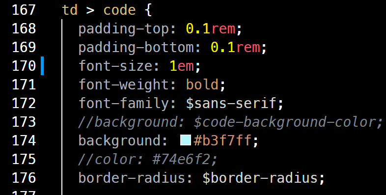

## Pre-Install
1. ruby install  
```bash
$ sudo apt install ruby ruby-dev build-essential
$ echo '# Install Ruby Gems to ~/gems' >> ~/.bashrc
$ echo 'export GEM_HOME=$HOME/gems' >> ~/.bashrc
$ echo 'export PATH=$HOME/gems/bin:$PATH' >> ~/.bashrc
$ source ~/.bashrc
```
2. Jekyll, bundler install  
```bash
$ gem install jekyll bundler
```
3. bundle  
```bash
$ bundle
```
4. local hosting  
```bash
$ bundle exec jekyll serve
# Host on 127.0.0.1:4000
```

- 만약, **category**등이 업데이트 안되면 <span style="color:magenta">**메타 데이터**</span>를 제거해야한다.
```bash
$ rm -rf .jekyll-*
$ bundle exec jekyll serve
```

## Settings
1. 글꼴, 여백 관련
https://danggai.github.io/github.io/

## SideBar
- **\_data/navigation.yml**
  
```yml
docs:
   - title: LINUX
      children:
      - title: LINUX_compile
         url: /categories/#linux-compile <--- B
```
  
- **\_posts/일반_포스트.md**
  
```markdown
---
...
categories:
- linux-compile <--- A
---
```

Match categories: `A` in post to url: /categories/#`B` in **navigation.yml**

### post url
---
  
```markdown
# file name: 2021-1-2-socket_programming_1.md
---
...
categories:
- socket-programming
```

This post get url "https://yourID.github.io`/socket-programming/socket_programming_1`"

/**`categoreis of the post`**/**`file title without date`**
 
  

## Change Highlight color
  
```bash
$ _sass/minimal-mistakes/_base.scss
```

1. find string `td > code`. It may be at 167 line

2. insert `color: #COLOR_HEX_CODE` above string \'border-radius:...'
   - It is letter color in hightlight

3. `background` is highlight background color




